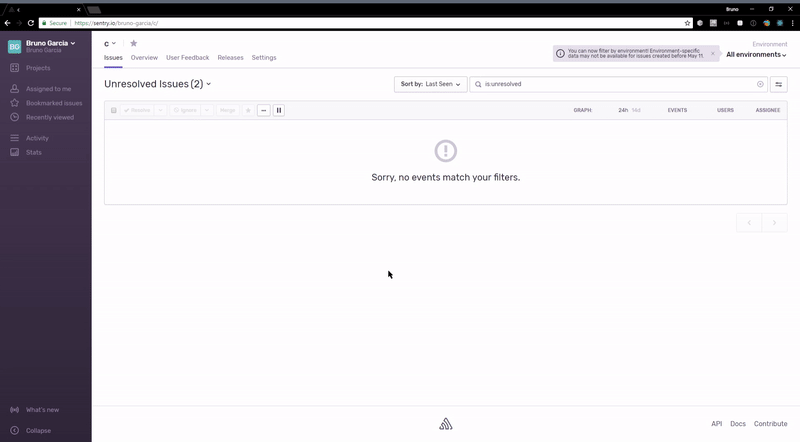

# Sample integration of log4net with Sentry

This is a simple console application that demonstrates how you can add Sentry to your applications using log4net.

`Program.cs` doesn't have any reference to Sentry. In fact, it doesn't even include a `using Sentry;` directive.
The integration is simply done by adding the [Sentry.Log4Net](https://www.nuget.org/packages/Sentry.Log4Net) package to you project and configuring the appender via xml.

It's possible to use the SDK throughout you app to as the documentation describes.

If you for example call `SentrySdk.AddBreadcrumb("crumb")`, all log4net events will include that breadcrumb.

**Please refer to the [documentation for details](https://getsentry.github.io/sentry-dotnet/).**

## Running this sample

You can run this sample with Visual Studio, or via the command line.

With the .NET Core SDK:

```sh
λ dotnet run
2018-07-21 21:59:40,704 [1] DEBUG Program - Debug message which is not sent.
2018-07-21 21:59:40,716 [1] INFO  Program - InfoFormat: About to throw NotImplementedException type of exception.
2018-07-21 21:59:40,866 [1] ERROR Program - Error: with exception
System.NotImplementedException: The method or operation is not implemented.
   at Program.DoWork()
   at Program.Main()
```

This will capture two events in Sentry. Since the `csproj` was modified to set a version, the SDK is able to detect the version and Sentry will display the `release` affected.

The appender was configured to capture the `User` of the application. Note that is has to be explicitly opted-in.



