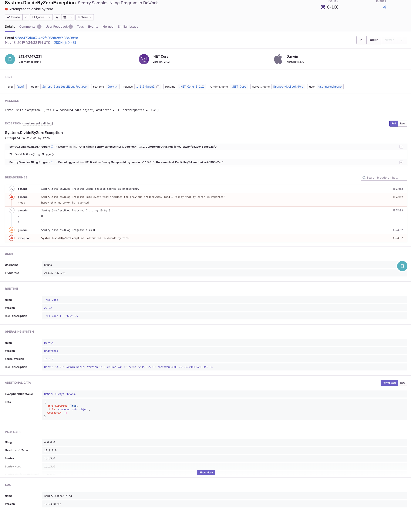

# Sample integration of NLog with Sentry

This is a simple console application that demonstrates how you can add Sentry to your application using NLog.

This project attempts to sample the integration by using code only and also via the configuration file.
In both cases **you need to add your own DSN** so you can see the events sent in your Sentry project.

You can get your [Sentry DSN at sentry.io](https://sentry.io).
Make sure to add it to both `NLog.config` and `Program.cs` in this directory.

## Running this sample

Now you're ready to run the code.
You can run this sample with Visual Studio, or via the command line.

With the .NET Core SDK:

```sh
λ dotnet run
15:34 $ dotnet run
2019-05-13 15:34:30.7319|TRACE|Sentry.Samples.NLog.Program|Verbose message which is not sent.
2019-05-13 15:34:30.7716|DEBUG|Sentry.Samples.NLog.Program|Debug message stored as breadcrumb.
2019-05-13 15:34:30.7782|ERROR|Sentry.Samples.NLog.Program|Some event that includes the previous breadcrumbs. mood = "happy that my error is reported"
2019-05-13 15:34:30.8547|INFO|Sentry.Samples.NLog.Program|Dividing 10 by 0
2019-05-13 15:34:30.8567|WARN|Sentry.Samples.NLog.Program|a is 0
2019-05-13 15:34:30.8586|FATAL|Sentry.Samples.NLog.Program|Error: with exception. { title = compound data object, wowFactor = 11, errorReported = True }
2019-05-13 15:34:32.1986|TRACE|Sentry.Samples.NLog.Program|Verbose message which is not sent.
2019-05-13 15:34:32.1997|DEBUG|Sentry.Samples.NLog.Program|Debug message stored as breadcrumb.
2019-05-13 15:34:32.1997|ERROR|Sentry.Samples.NLog.Program|Some event that includes the previous breadcrumbs. mood = "happy that my error is reported"
2019-05-13 15:34:32.2005|INFO|Sentry.Samples.NLog.Program|Dividing 10 by 0
2019-05-13 15:34:32.2005|WARN|Sentry.Samples.NLog.Program|a is 0
2019-05-13 15:34:32.2010|FATAL|Sentry.Samples.NLog.Program|Error: with exception. { title = compound data object, wowFactor = 11, errorReported = True }
```



**Please refer to the main SDK [documentation for more details](https://getsentry.github.io/sentry-dotnet/).**
